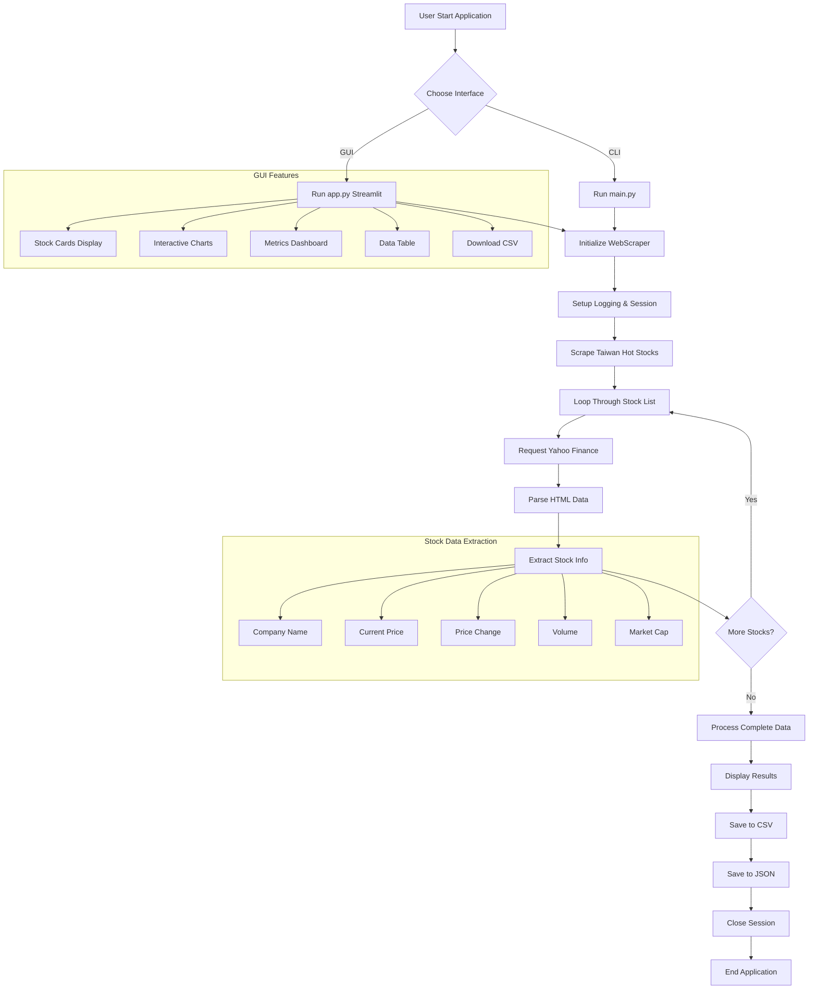
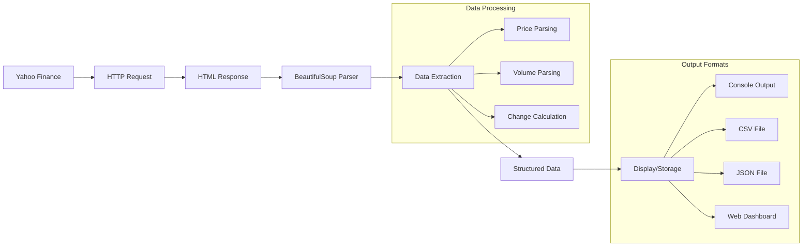
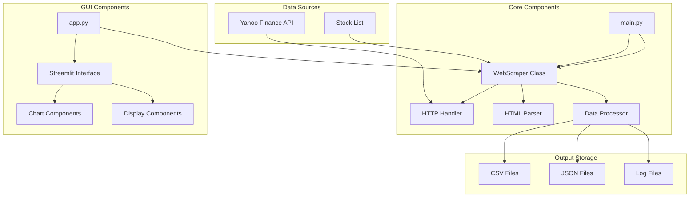
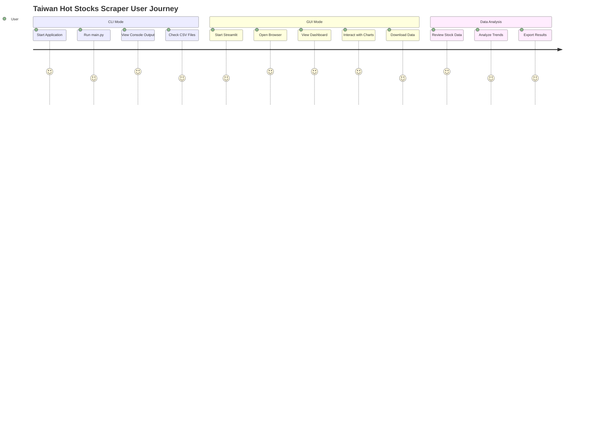
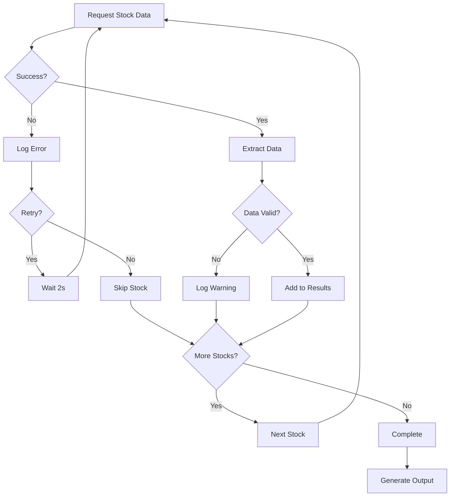
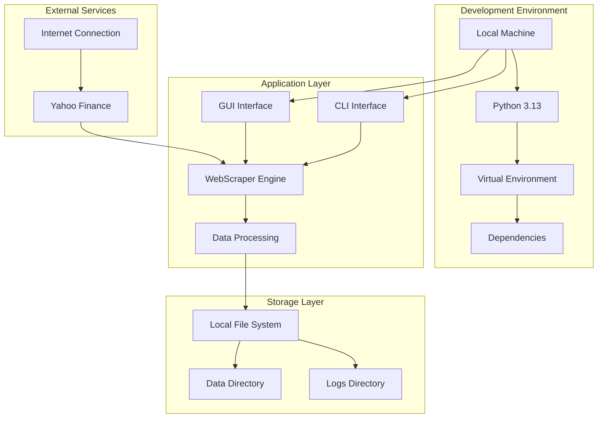

# Taiwan Hot Stocks Scraper - Project Workflow Diagram

## System Architecture Flowchart

## Data Flow Process

## Component Interaction Diagram

## User Interaction Flow

## Error Handling Flow

## Deployment Architecture

